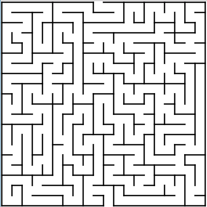
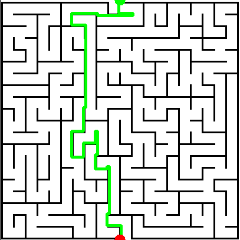
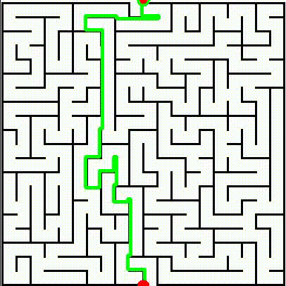

# 2D_Maze_Optimal_Path_Generation

## Project Description
This project solves a **2D maze navigation** problem using the A* algorithm. The objective is to guide a robot from the **entrance** (top of the maze) to the **exit** (bottom of the maze) by parsing a maze image and generating an optimal path.

###  1: Code Implementation and Descreption

### **Key Features:**
**Maze Representation:** <br>
The maze image is first parsed, and its content is used to create a grid representation of the maze where each cell indicates whether it is a free path or an obstacle.<br>

How the Maze Image is Used - Image Preprocessing: The maze image is loaded and converted into a binary format where:<br>

 - 255 represents a free path (or walkable area).<br>
 - 0 represents a wall (or obstacle). <br>

This is done using the cv2.threshold function from OpenCV, which converts the grayscale image into a binary image. The start and goal positions are then detected based on specific criteria (e.g., the entrance is located at the top, and the exit is located at the bottom).<br>

`maze.py` file handles the maze image parsing and prepares the data for path planning.
It scans the binary image to identify walls and free spaces and maps the maze onto a 2D grid.
It also calculates the start and goal positions by analyzing the maze image, ensuring that the start is at the top (first available free space) and the goal is at the bottom.

The binary representation is crucial as it simplifies the maze into a graph of cells that can be processed by the pathfinding algorithm.
By turning the maze into a 2D array of binary values, the algorithm can focus on navigating the open spaces and avoiding walls. This grid-based approach aligns perfectly with the A* algorithm’s requirement for a clear distinction between navigable space and obstacles.

 **Path Planning:** 
- The A* algorithm calculates the shortest path from **start** to **goal**, avoiding obstacles.

## How Code Runs the Path Planning/ Description of the A* Algorithm
The A* (A-star) algorithm is a widely used pathfinding and graph traversal algorithm that finds the shortest path between two points. It is commonly used in robotics, video games, and other applications requiring efficient path planning. 

The algorithm combines the strengths of:
- **Dijkstra's Algorithm:** Guarantees the shortest path but can be slow.
- **Greedy Best-First Search:** Faster but doesn't guarantee the shortest path.

## How A* Works:

### 1. **Heuristic Function (`h(n)`):**
   - A* uses a heuristic function `h(n)` to estimate the cost from the current node to the goal.
   - This guides the search toward the goal efficiently.

### 2. **Cost Function (`f(n)`):**
   The total cost for a node `n` is calculated as:
   f(n) = g(n) + h(n)

- `g(n)` → The actual cost from the start node to the current node `n`.
- `h(n)` → The estimated cost from the current node `n` to the goal.

### 3. **Open and Closed Lists:**
- **Open List:** This contains nodes that need to be evaluated. The node with the lowest f(n) value is expanded first. This process is commonly implemented using a Priority Queue. 

- In Python, the 'queue' module can be used to manage the priority queue, ensuring that nodes are processed in the correct order based on their priority, typically selecting the node with the lowest f(n) value. The priority queue helps maintain the order in which nodes are evaluated, using a mechanism that can prioritize nodes based on either FIFO (First In, First Out) or LIFO (Last In, First Out), depending on the use case.

### 4. **Process:**
- Start from the initial node and add it to the **Open List**.
- While the **Open List** is not empty:
  - Select the node with the lowest `f(n)` value.
  - If this node is the goal, reconstruct the path and return it.
  - Otherwise, expand its neighbors.
  - For each neighbor, calculate `f(n)` and add it to the **Open List** if not already processed.

### 5. **Termination:**
- The algorithm stops when the goal node is reached or when the **Open List** is empty (indicating no path exists).

**Visualization:** 
- The maze and the computed path are visualized using OpenCV for better understanding.

**Input:**
- The maze can be provided as an image (`.png`) or a text file (2D array).
<br>


**Output:**
- The program generates the optimal path and visualizes it on the maze.

`astar.py`

<br>


`astar_with_animation.py`

<br>


## Files in the Repository
- `maze.py`: Contains the Maze class, which loads particular image of this project only and processes a maze image, converts it into a binary grid, and identifies the start and goal positions. The class also creates a map of the maze, showing available movement directions for the pathfinding algorithm.

- `simple_img_to_maze_generation.py`: Converts any maze image into a binary grid format for use in path planning.

- `1maze_array.txt` : I have also created the 2D array of the image being used in this project.

- `astar.py`: Implements the A* algorithm to find the shortest path from the start to the goal using the maze grid generated from the image.

- `astar_with_animation.py`: Enhances the A* algorithm by visualizing the search and pathfinding process.

- `images/maze.png`: The maze image used for this project.

- `images/final_output.png`

- `images/outputvideo.avi`


## Getting Started
### Prerequisites
- Python 3.x
- opencv-python==4.10.0.84
- numpy==1.21.5

### Installation
Clone the repository to your local machine:
```bash
git clone https://github.com/Urviskumar/2D_Maze_Optimal_Path_Generation.git
```
Navigate to the repository
```bash 
cd ~/2D_Maze_Optimal_Path_Generation
```
Create a virtual environment in python3:
```bash
python3 -m venv path_planning
```
```bash
source path_planning/bin/activate  # Activate the environment
```

Install the required packages:
```bash
pip install requirements.txt
```
Run the code<br>
- A_Star path generated
```bash
python3 astar.py  --image_path_of_maze.png # add the argument here of the image path
```

- A_Star and robot moving through the path generated
```bash
python3 astar_with_animation.py  --image_path_of_maze.png # add the argument here of the image path
```

### 2. Motion Planning Considerations for a Robotic Arm Tracing a Maze

The robot and maze image coordinate systems should be aligned and the position of the pen tip relative to the robot’s end effector must be precisely defined and calibrated.

The robotic arm needs to have a sufficient number of degrees of freedom (DOF) to perform the task. The DOF determines the number of independent movements the arm can make. For a planar maze traversal, at least 3 DOF are required (two for planar movement and one for orientation control of the pen).

Reachability: The entire maze surface should be within the reachable workspace of the robot's end-effector. The arm should be able to orient the pen correctly at every point in the maze for accurate tracing.

Control the motion of individual joints to achieve the desired end-effector position and sensors should provide real-time feedback for position and orientation of the end effector.

### 3. Motion Planning Considerations for a Mobile Robot Tracing a Maze

Perception:-
The robot needs to be equipped with sensors like LiDAR and cameras for environmental perception. LiDAR can help detect obstacles and measure distances, while cameras can assist in visual feature detection for localization and mapping.

State Estimation and Localization:-
The robot must estimate its position and velocity within the maze to understand its current location. This can be achieved using state estimation techniques like Extended Kalman Filter (EKF) or Particle Filter, along with data from wheel odometry, IMUs, and visual sensors.

Mapping and SLAM:-
If the maze map is unknown, the robot must create it in real-time while navigating. Simultaneous Localization and Mapping (SLAM) techniques like GMapping or Cartographer can help the robot build a map while localizing itself. A pre-existing map can also be used if available, provided it is accurately aligned with the robot's coordinate frame.

Path Planning and Trajectory Generation:-
The A* algorithm, as implemented in the project, can be extended for mobile robots by considering a grid-based map representation of the maze. The algorithm helps generate an optimal trajectory.

Collision Avoidance:
LiDAR data can be used for real-time collision detection and avoidance, ensuring the robot can adjust its trajectory dynamically.

Control and Actuation:
The robot's motion system needs to be controlled using techniques like PID control or MPC for differential drive systems.


---
# Acknowledgements

## Maze Generator
This project utilizes the maze generator and map the image into A* algorithm for which logic is taken from the [pyamaze Public](https://github.com/MAN1986/pyamaze/blob/main/pyamaze/pyamaze.py) project by [MAN1986](https://github.com/MAN1986). 

## AI Assistance - ChatGPT

This project also benefited from Chat AI solutions to optimize the implementation, which include the following:

- Integrating the generated maze into the path planning file: Guidance was provided on how to leverage the maze format in path planning.

- Determining start and goal positions from the maze's binary image: Solutions were shared for effectively extracting start and goal points from a binary maze image.

- Using the Priority Queue in A*: Advice was offered on efficiently using a Priority Queue in A* to ensure optimal pathfinding.

- Animating the path: Support was provided for visualizing the robot's movement along the generated A* path in a video format.

Citation:
```
MAN1986. 2023. python-maze. GitHub repository. https://github.com/MAN1986
```

